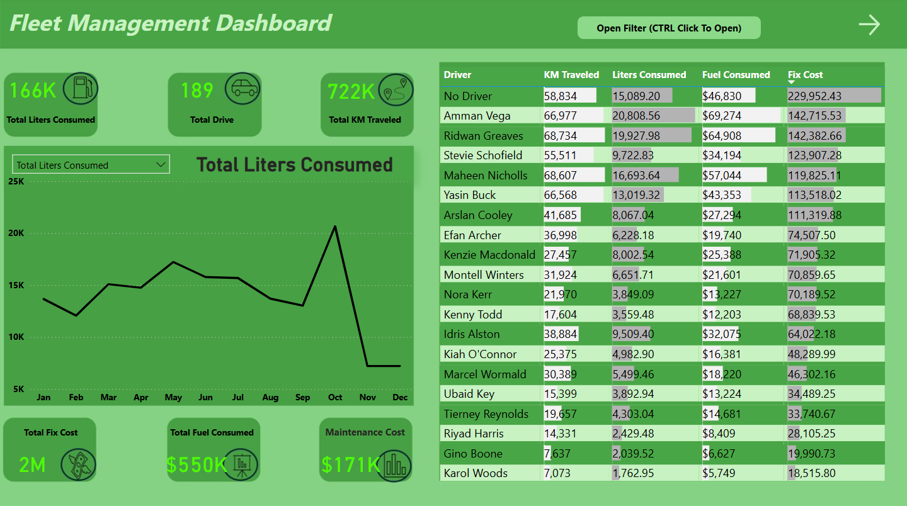
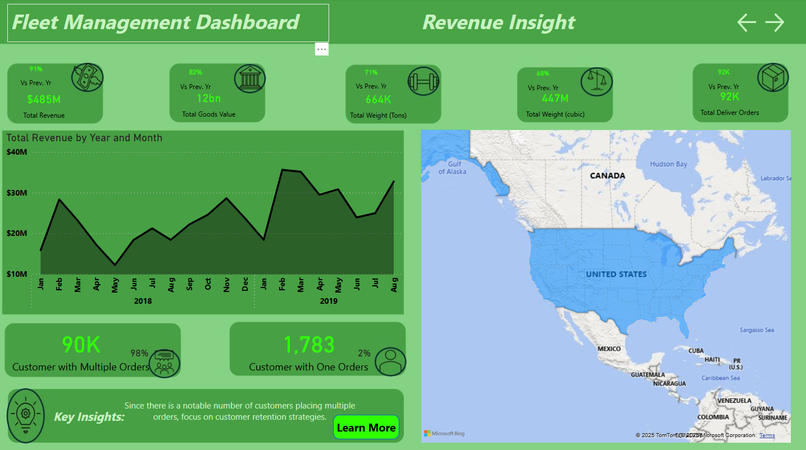
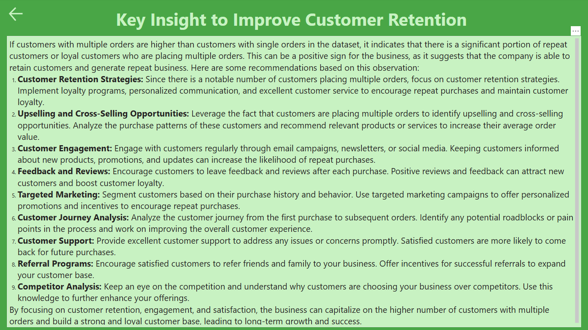

# Fleet-Management-Project

This project analyzes a real world style fleet management dataset using **SQL** and **Power BI**. It focuses on uncovering trends in delivery performance, revenue, and vehicle efficiency. The goal is to simulate a real business intelligence workflow, from data cleaning and querying to visualizing and interpreting key operational metrics. The completed .pbix and .sql files, along with the full dataset used, and screenshots of the dashboard are in the repository for viewing and download.

The Power BI dashboard is fully interactive — users can:
- Click on visuals to **filter related data**
- **Hover** to view detailed tooltips
- Navigate across **multiple pages** using page selectors
- Click on a **state** to drill down into its specific performance metrics

This simulates how businesses explore and act on their data using modern BI tools.

## 📊 Power BI Dashboard Screenshots

### 🚗 Driver Dashboard

### 💵 Revenue Insight

### 💡 Key Insights

